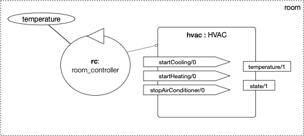

# Multi-Agent Oriented Programming Tutorial
:toc: right
:author: 23rd European Agent Systems Summer School
:date: July 2023
:source-highlighter: coderay
:coderay-linenums-mode: inline
:icons: font
:prewrap!:

This guide contains practical material for the tutorial _Multi-Agent Oriented Programming_ at https://easss23.fit.cvut.cz[23rd European Agent Systems Summer] School, 2023, Prague.

= Scenario

(SmartRoom)

initially we consider one agent in a room ....

= JaCaMo Setup (Lab 1)

The simplest way to run the examples and do the exercises is by using https://gitpod.io/#https://github.com/jomifred/easss-23[GitPod, following this link] (a github account is required).

To run the initial project, type the commands below in the terminal:
----
cd hello-world
./gradlew
----

= Agent Dimension (Lab 1)

Activities and Exercises (ideas)

----
cd ag-smart-room1
./gradlew
----

(after introduction to agent and execution)

- change the preferred temperature

- [add wait to avoid busy waiting; what are the problem, could the wait of 10 minutes? how to solve? point to doc of wait and wait for an event]

- [add a plan to print the state of the HVAC]
  [if "off" print "turned of", if "on" print "turned on"]
  [enforce unification instead of if]

- [create a plan to stop and use jason cli to trigger it -- difficult without REPL]

- [another implementation with !temperature(XX) goal that works; then add two goals; [give the code for that]; exercise is to understand the code, the agent behaviour and explain the problem]

= Agent (Communication) Dimension (Lab 2)

= Environment Dimension (Lab 3)

= Organisation Dimension (Lab 4)

