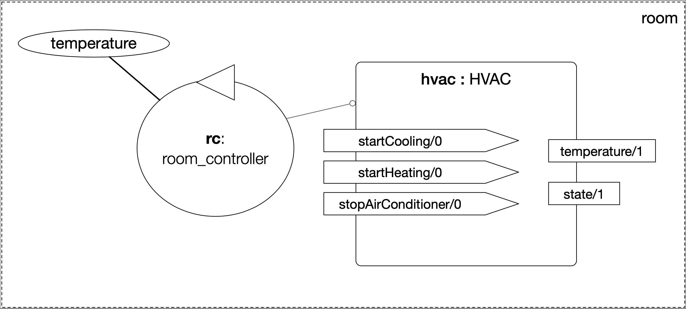

# Multi-Agent Oriented Programming Tutorial
:toc: right
:author: 23rd European Agent Systems Summer School
:date: July 2023
:source-highlighter: coderay
:coderay-linenums-mode: inline
:icons: font
:prewrap!:

This guide contains practical material for the _Multi-Agent Oriented Programming_ tutorial at the https://easss23.fit.cvut.cz[23rd European Agent Systems Summer School] (Prague, 2023).

== Smart Room Scenario

The objective is to develop an MAOP system to control the temperature of a room so that it reaches some desired target temperature. The room is equipped with a "Heating, Ventilating, and Air  Conditioning" (HVAC), that provides:

* the current room temperature
* operations to start cooling, start heating, and stop the machine

Initially, we have one agent that has the goal of maintaining a certain temperature.

== Agent Dimension (Lab 1)

=== Task 1: run the initial project for the smart room scenario

The simplest way to run the examples and do the exercises is by using https://gitpod.io/#https://github.com/JaCaMo-EASSS23/code[GitPod, following this link] (a github account is required). You can also work locally by cloning this repository (https://github.com/JaCaMo-EASSS23/code). Java and VSCode should be installed in this case.

To run the initial project, type the commands below in the terminal:
----
cd lab1/smart-room-sa
./gradlew
----

You can see how the system reacts to changes in temperature by opening another terminal and executing the command:

----
curl -X POST  http://localhost:8080/workspaces/room/artifacts/hvac/properties/temperature -H 'Content-Type: application/json' -d '[ 10 ]'
----

replacing the last number 10 by the current temperature of the room.

=== Task 2: Reading and understanding agent programs

* Exercise 1: open the code of the room controller agent (file `src/agt/room_controller.asl`), read the code and identify the beliefs, goals, and plans. Try to map the program to the observed behavior. 

* Exercise 2: open the _mind inspector_ for agent `rc` and compare the beliefs there with those identified in the program. Are they the same? Are represented the same way? 

* Exercise 3: change the program so that the target temperature is 15.

=== Task 3: Improve the implementation

* Exercise 4: add a new plan to print the current state of the HVAC.

* Exercise 5: change the plans of previous exercise so that when the hvac state is `"cooling"` it is printed "so cool" and, when the state is `"heating"` it is printed "so hot".

* Exercise 6: open the project in folder `lab1/e6` and take a look at the room controller program. There is a difference in the last lines (line 17). Evaluate the reasons for that modification and the its problems. Some ideas about how to fix? (no need to develop the solution in Jason.)

* Exercise 7: open the project in folder `lab1/e7` and take a look at the room controller program. The target temperature is as an argument of goal `keep_temperature`. The project, as it is, works. But what happens if a line like `!keep_temperature(35)` is added in the program? Explain the behavior produced buy this change.

== Agent Communication (Lab 2)

=== Task 1: experiment different performatives

* open the project `lab2/e1`, read the `.jcm` file and the program of the two agents, and execute the application. Now change the plan of bob to:
+
----
+!start 
   <- .send(alice, tell, hello);
      .send(alice, tell, hello);
   .
----
+
run the project again and notice the difference. Now change the plan again to
+
----
+!start 
   <- .send(alice, signal, hello);
      .send(alice, signal, hello);
   .
----
+
run the project again and notice the difference.

* open the project `lab2/e2`, read the `.jcm` file and the program of the three agents, and execute the application. Use the mind inspector to see the beliefs of the agents. Now change the plan of alice to:
+
----
+!start
   <- .wait(500);
      .send(karlos, askOne, vl(_), vl(X));
      .println(X).
----
+
run the project again and notice the difference. 

=== Task 2: run the project for the voting protocol

To run the project, type the commands below in the terminal:
----
cd lab2/smart-room-ma
./gradlew
----

- example of askOne sync and async

- [case of many source and belief removal]

- [case of source of sources]

- [increment id]

- [use DF to find participants]

== Environment Dimension (Lab 3)

We will now implement the voting mechanism as an artifact: agents will use a _voting machine_ artifact to select the target temperature for the shared room based on their individual preferences.

Most of the code required for this practical session is already provided in the link:lab3/smart-room-vm[lab3/smart-room-vm] project. The following tasks will guide you through adding the last lines of code that will bring everything together.

=== Task 1: Implement the usage interface for the voting machine

The artifact template for our voting machine is defined in the link:lab3/smart-room-vm/src/env/voting/VotingMachine.java[VotingMachine.java] class, but the usage interface is not yet fully implemented. Your first task is to complete this implementation. The following sub-tasks will guide you through it, note also the `TODO` items marked in comments in the Java class.

- Task 1.1: Your very first task is to complete the artifact's `init` method by defining an observable property `status` and setting its value to  `open`.
- Task 1.2: Your second task is to complete the implementation of the `open`, `vote`, and `close` operations.

To solve these tasks, you will have to define and work with observable properties. Tips for a quick start:

- you can have a look at the implementation of the link:lab3/smart-room-vm/src/env/devices/HVAC.java[HVAC artifact]
- you can check out https://cartago.sourceforge.net/?page_id=69[Example 01 — Artifact definition, creation, and use] from https://cartago.sourceforge.net/?page_id=47[CArtAgO by Examples]

=== Task 2: Instantiate and use the voting machine

Your voting machine is now ready — and the room controller agent is, in fact, already using it (see link:lab3/smart-room-vm/src/agt/room_controller.asl[room_controller.asl]). Still, a few bits are missing:

- Task 2.1: Your first task is to complete the `TODOs` defined in link:lab3/smart-room-vm/src/agt/personal_assistant.asl[personal_assistant.asl] so that agents can focus on the voting machine and vote for their preferences.

- Task 2.2: The personal assistant agents are now expressing their votes, but still nothing is happening. That is because the voting is never closed. See the `TODO` on `line 33` of link:lab3/smart-room-vm/src/agt/room_controller.asl[room_controller.asl].

To solve these tasks, you will need to use the `focus` operation and to invoke artifact operations defined by the voting machine. Tips for a quick start:

* see Lines 19 in link:lab3/smart-room-vm/src/agt/room_controller.asl[room_controller.asl] for an example of using the `focus` operation

* see Line 24 in link:lab3/smart-room-vm/src/agt/room_controller.asl[room_controller.asl] for an example of invoking the `open` operation of the voting machine

* note: the voting machine is defined within the `vm::` namespace (see Lines 19 and 24 above for usage examples)

=== Task 3: Implement automatic closing with a countdown

Our agents are now using the voting machine to set the temperature in the shared room. At the moment, however, the room controller agent needs to invoke the `close` operation on the voting machine to close the voting — although the voting machine is already configured with a timeout.

Your task is to complete the implementation of the voting machine's `countdown` internal operation (see Line 97 in link:lab3/smart-room-vm/src/env/voting/VotingMachine.java[VotingMachine.java]). For an example of a similar implementation, see https://cartago.sourceforge.net/?page_id=108[Example 06 — Internal operations and timed await: implementing a clock] from https://cartago.sourceforge.net/?page_id=47[CArtAgO by Examples].

Once you finish implementing the internal operation, make sure to:

* uncomment Line 57 in link:lab3/smart-room-vm/src/env/voting/VotingMachine.java[VotingMachine.java], which invokes the `countdown` internal operation

* udpate the plan of the room controller agent for `+!voting(Options)` (see `TODOs`)

=== Task 4: Implement a linked operation

Your agents are happy with their brand new voting machine — and would like to showcase it to other agents via https://dweet.io/[Dweet.io]. Luckily, they already have a link:lab3/smart-room-vm/src/env/social/DweetArtifact.java[DweetArtifact] artifact template that they can use for this purpose.

Your task is to complete the link:lab3/smart-room-vm/src/agt/room_controller.asl[room_controller.asl] agent program with the following steps (see `TODOs`):

* Line 20: to create an instance of a `DweetArtifact` after creating the voting machine

* Line 23: to link the voting machine to the newly created `DweetArtifact` using the operation `linkArtifacts(ArtId1, "port", ArtId2)`

** note: the voting machine artifact template already defines an output port named `publish-port`

** for further examples and documentation on linking artifacts, see https://cartago.sourceforge.net/?page_id=126[Example 08 — Linkability] from https://cartago.sourceforge.net/?page_id=47[CArtAgO by Examples]

If you enjoyed this practical session, make sure to check out https://cartago.sourceforge.net/?page_id=47[CArtAgO by Examples] for a complete tour of all features supported for the enviornment dimension.

== Organisation Dimension (Lab 4)

